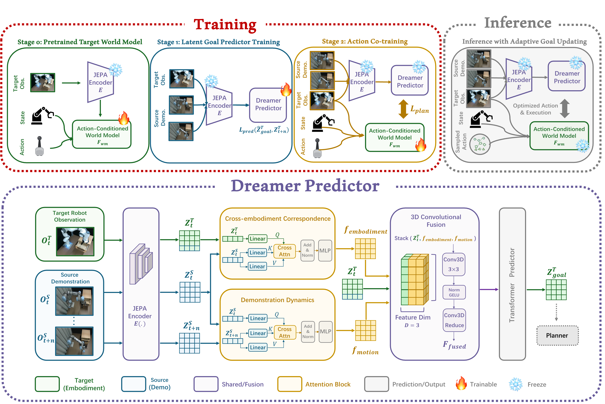

# Demo-JEPA: Joint-Embedding Predictive Architecture for One-shot Cross-Embodiment Imitation

[[Project page]](https://log2r.github.io/Demo-JEPA/)
[[Paper]](https://arxiv.org/abs/2605.20811)



# Install
```console
# clone the repo
git clone --recursive https://github.com/banban3forever/Demo-JEPA.git
# install conda env
conda create -n djepa python=3.12
conda activate vjepa2-312
pip install .  # or `pip install -e .` for development mode
pip install diffusers==0.11.1
# There will probably be an error related to 'cached_download'. You can manually delete the import action in your conda environment at '.../site-packages/diffusers/dynamic_modules_utils.py'.
```

# Data Collection

Before collecting simulation data, please install RLBench Our simulation data are collected using RLBench. Before running the data collection pipeline, please first install the RLBench simulation environment by following the official RLBench installation guide:

https://github.com/stepjam/RLBench

Please make sure that RLBench, PyRep, and CoppeliaSim are correctly installed, and that the required CoppeliaSim environment variables have been configured. For headless servers, please also follow the official RLBench instructions for headless rendering.

The scripts related to data collection are located in `scripts/rlbench_tools`, which supports collecting paired training demonstrations for different RLBench tasks and robot embodiments.

For example, to launch data collection for one RLBench task, run:
```bash
python scripts/rlbench_tools/cli.py \
  --save_path "/path/to/your/saved_data" \
  --task "task_name" \
  --source_robot "panda" \
  --robots panda sawyer \
  --image_size 640 480 \
  --renderer "opengl" \
  --variations -1 \
  --total_episodes 200 \
  --arm_max_velocity 1.0 \
  --arm_max_acceleration 4.0 \
  --max_demo_attempts 2 \
  --seed_master 2333 \
  --dt 0.033 \
  --settle_pos_eps 0.01 \
  --settle_ori_eps_deg 2.0 \
  --settle_max_steps 40 \
  --camera_json "scripts/rlbench_tools/cams_extrinsics.json" \
  --headless
```
The key arguments are:

- `--save_path`: output directory for the collected demonstrations.
- `--task`: RLBench task name to be collected.
- `--source_robot`: source robot used to generate the reference demonstrations.
- `--robots`: robot embodiments to be included in the collection process.
- `--image_size`: rendered image resolution.
- `--renderer`: rendering backend used by RLBench.
- `--variations`: task variation index. Setting it to `-1` uses all available variations.
- `--total_episodes`: total number of episodes to collect.
- `--arm_max_velocity`: maximum arm velocity during execution.
- `--arm_max_acceleration`: maximum arm acceleration during execution.
- `--max_demo_attempts`: maximum number of attempts for generating one valid demonstration.
- `--seed_master`: random seed for reproducible data collection.
- `--dt`: simulation control time step.
- `--settle_pos_eps`: position tolerance used to check whether the robot has reached the target pose.
- `--settle_ori_eps_deg`: orientation tolerance, in degrees, used to check whether the robot has reached the target pose.
- `--settle_max_steps`: maximum number of settling steps after motion execution.
- `--camera_json`: path to the camera extrinsic configuration file.
- `--headless`: enables headless data collection.

We choose aloha hdf5 as our dataset format. We DO NOT use the original `action` attribute because there will be fps downsampling within dataloader and we calculate the action based on the downsampled qpos instead.
Basic aloha format:
```
.
├── action
└──  observations
    ├── images
    │   ├── image_key1
    │   └── image_key2
    └── qpos
```

# Training

## Stage0: VJEPA2.1-AC
```
# modify the config file ./configs/train/vjepa_2_1/vjepa_2_1_ac.yaml
bash .../Demo-JEPA/scripts/vjepa_2_1_ac.sh
```
## Stage1: Dreamer Predictor
```
# modify the config file ./configs/train/vjepa_2_1/vjepa_2_1_dreamer_predictor.yaml
bash .../Demo-JEPA/scripts/vjepa_2_1_dremer_predictor.sh
```
## Stage2: Co-training
```
# modify the config file ./configs/train/vjepa_2_1/vjepa_2_1_dreamer_ac.yaml
bash .../Demo-JEPA/scripts/vjepa_2_1_dreamer_ac.sh
```
## Extra imitation experiment
```
# modify the config file ./configs/train/vjepa_2_1/vjepa_2_1_imitation.yaml
bash .../Demo-JEPA/scripts/imitation.sh
```

# Deploy
Once you finish the training, you can deploy the model using `.../Demo-JEPA/app/vjepa_2_1_dreamer_ac/deploy.py` for demo-jepa and `.../Demo-JEPA/app/vjepa_2_1_imitation/deploy.py` for imitation experiment.

# Acknowledgment
Our main code base is build upon [VJEPA2&VJEPA2.1](https://github.com/facebookresearch/vjepa2).
Imitation experiment is adapted from [Diffusion Policy](https://github.com/real-stanford/diffusion_policy).
Simulation data and deploy pipeline come from [RLBench](https://github.com/stepjam/RLBench).
